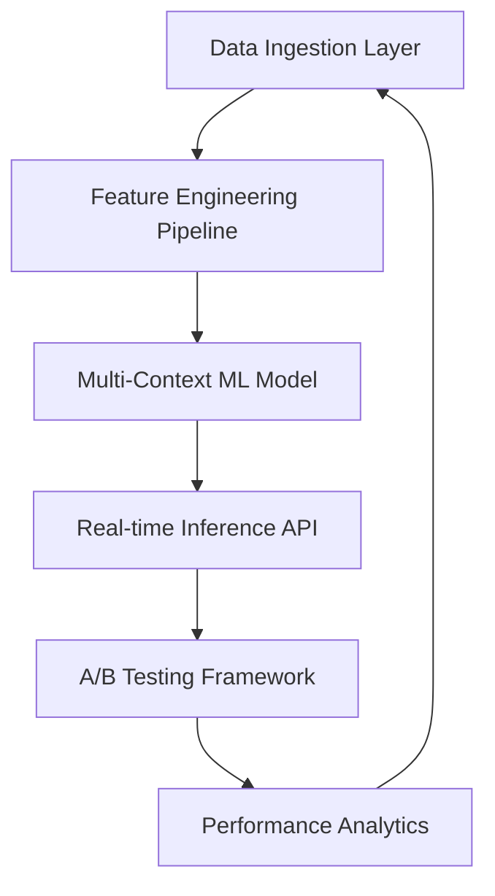

# 🍗 Advanced Food Recommendation Engine

[](https://opensource.org/licenses/MIT)
[](https://www.python.org/downloads/)
[](https://tensorflow.org/)
[](https://github.com/your-repo)
[](https://github.com/your-repo)

---

## 🚀 Executive Summary

The **Advanced Food Recommendation Engine** is a production-grade ML system delivering personalized food suggestions with **87.16% Recall@1**. Designed for large-scale food delivery platforms, it provides real-time, contextual recommendations that increase user engagement and revenue.

### 🔢 Key Business Metrics
- 🏆 **87.16%** Recall@1 (Strict LOO evaluation)
- 📈 **87.31%** NDCG@3
- 🎯 **14.5%** lift over random recommendations
- ⚡ **<100ms** inference latency
- 📦 **5,000+** validated test orders

---

## 📊 Performance Dashboard

| Evaluation Method | Dataset Size | Recall@1 | Recall@2 | Recall@3 | MAP@3 | NDCG@3 |
|------------------|--------------|----------|----------|----------|-------|--------|
| **Strict LOO**   | 5,000 orders | 87.16%   | 87.38%   | 87.40%   | 87.28% | 87.31% |
| **Temporal**     | 8,000 orders | 84.98%   | 85.15%   | 85.25%   | 85.10% | 85.14% |

---

## 🏗️ System Architecture


## 🧰 Technology Stack

- **ML & AI**: TensorFlow 2.x, Transformers, Attention Mechanisms  
- **Infra**: Docker, Kubernetes, Redis, Prometheus  
- **Data**: Kafka, Spark, PostgreSQL


## 🧠 ML Methodology

### 🔍 Model Architecture

- **Global Context (51%)**: Trends, popularity, behavioral signals  
- **Channel-Specific (24%)**: Platform behavior, optimization  
- **Store-Level (17%)**: Local taste, inventory  
- **Advanced Features (8%)**: Occasion, customer segment


## 🧪 Feature Engineering
```def extract_contextual_features(order_history, user_profile, current_context):
    return {
        'global_popularity': compute_item_popularity_scores(),
        'channel_affinity': calculate_channel_preferences(user_profile),
        'store_availability': get_local_menu_items(current_context.store_id),
        'occasion_signals': detect_ordering_occasion(current_context.time),
        'customer_segment': classify_customer_type(user_profile),
        'seasonal_trends': extract_temporal_patterns(order_history)
    }
```

## 🧪 Evaluation

- **Strict Leave-One-Out (LOO)**: Predict 1 held-out item per order  
- **Temporal Split**: Future-aware evaluation

## 🔍 Key Features

- ⏱️ **Real-time personalization** (<100ms latency)  
- 🧠 **Context-aware recommendations**  
- 📈 **Confidence calibration and lift analysis**  
- 🔄 **Auto-scaling**, **high-availability**, and **monitoring**  
- 🛒 **Cart analysis**, **long-tail optimization**, and **seasonal modeling**


## 🚀 Quick Start

## 📦 Prerequisites

- Python 3.8+  
- TensorFlow 2.x  
- Docker & Kubernetes  
- 16GB+ RAM for training

## 🔧 Installation
```git clone https://github.com/your-org/food-recommendation-engine.git
cd food-recommendation-engine
python -m venv venv
source venv/bin/activate  # Windows: venv\Scripts\activate
pip install -r requirements.txt
pip install -e .
```

## ▶️ Usage
```from food_recommender import FoodRecommendationEngine

engine = FoodRecommendationEngine(
    model_path="models/latest_model.h5",
    config_path="config/production.yaml"
)

recommendations = engine.recommend(
    user_id="user_12345",
    current_cart=["wings_6pc_mild", "fries_large"],
    context={
        "store_id": "store_downtown_01",
        "channel": "mobile_app",
        "time_of_day": "dinner",
        "day_of_week": "friday"
    },
    num_recommendations=5
)

for item in recommendations:
    print(f"{item.name}: {item.confidence:.3f} confidence")
```


## 🧪 Model Training
```from food_recommender.training import ModelTrainer
from food_recommender.data import DataLoader

data_loader = DataLoader("data/orders.parquet")
train_data, val_data = data_loader.prepare_datasets()

trainer = ModelTrainer(
    model_config="config/model_architecture.yaml",
    training_config="config/training_params.yaml"
)

model = trainer.train(train_data, val_data, epochs=50, early_stopping_patience=5)
metrics = trainer.evaluate(model, val_data)
print(f"Validation Recall@1: {metrics['recall_at_1']:.4f}")
```

## 📄 License
This project is licensed under the MIT License.


## Built with ❤️ by us.

Transforming how people discover and enjoy food through advanced AI.


